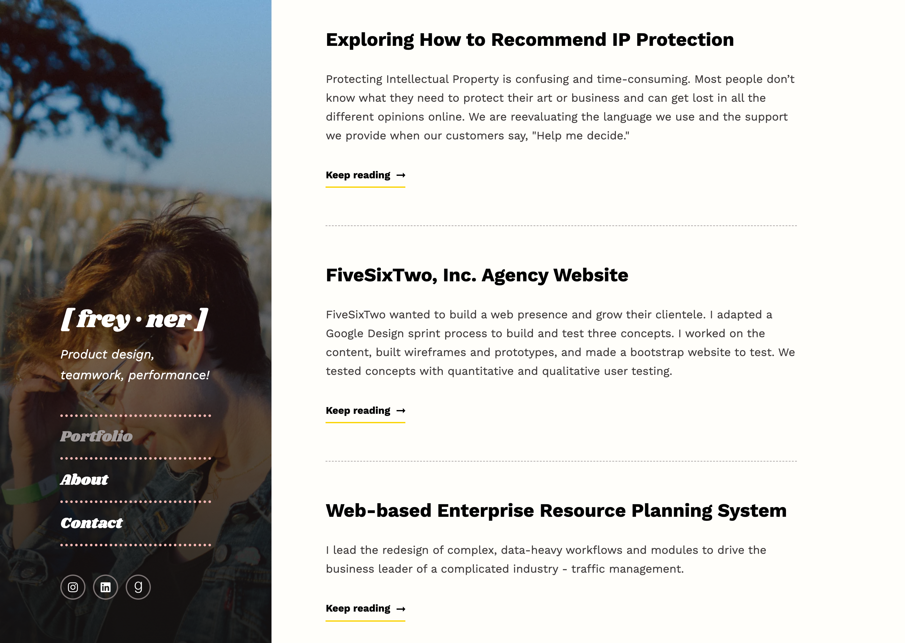
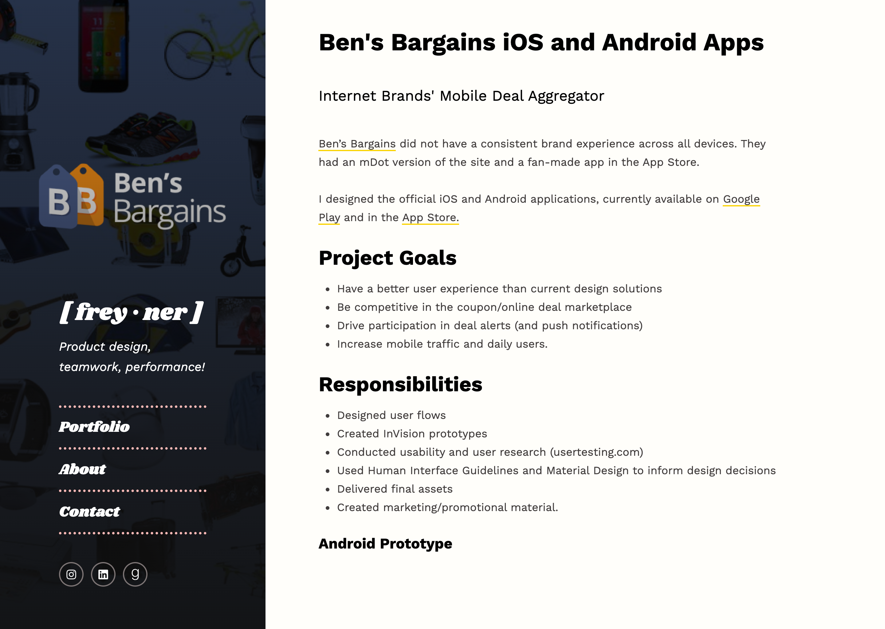
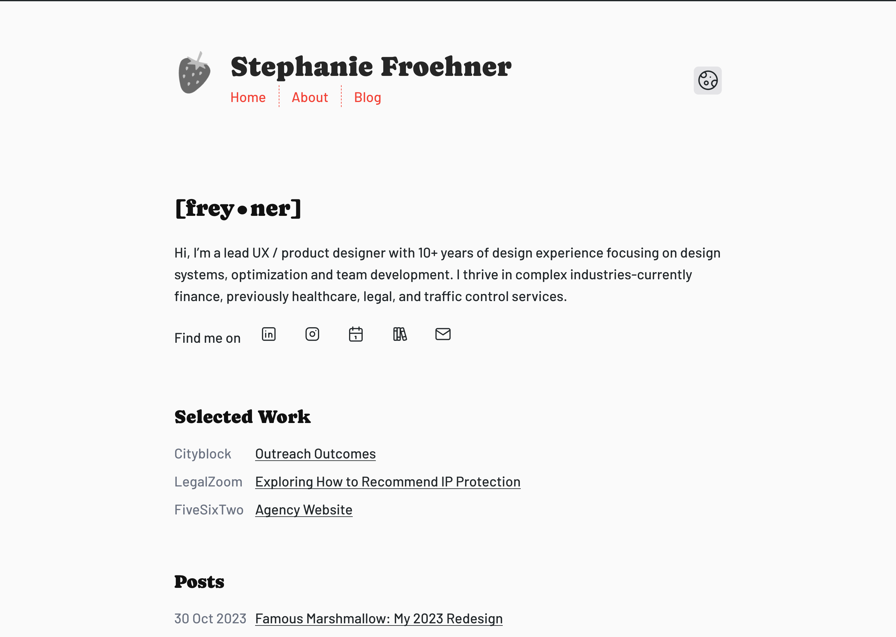
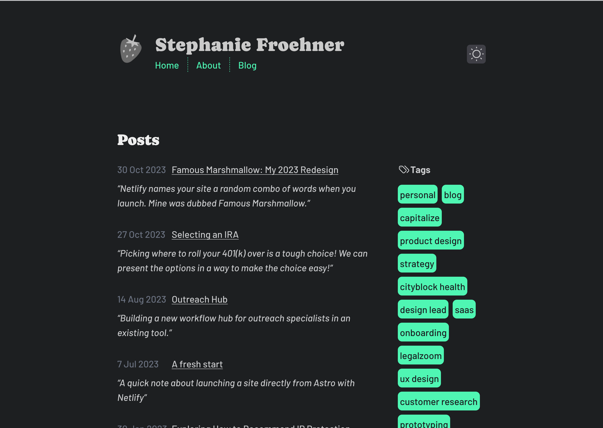
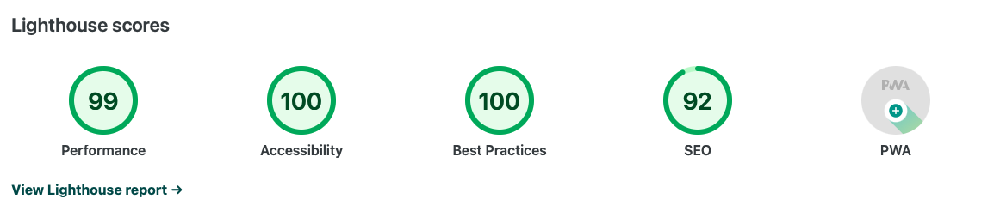

# Background
I'm finally on my real URL now, but I'll kinda miss the old Famous Marshmallow Netlify subdomain!

## The old portfolio site

# Launching today

## Highlights
- Markdown instead of an additional CMS to complicate things
- Rebrand! Been feeling this cute strawberry motif lately.
- Dark mode!
- A blog!

# Next steps

- My new site is still a work in progress (like, I really want images to look/work better, 100s in Lighthouse, and to be a PWA), but I'm stoked to get it out! 

# Quick recommendation
[Balder's Gate 3](https://baldursgate3.game) on Playstation. I'm playing a split-screen co-op campaign with my partner right now... I see how many hours we've put into this game and I'm in denial. It's SO much fun though. Obsessed with [Raphael's Final Act](https://open.spotify.com/track/3KBQN4dBHxyLEdCNCfSKMV?si=9ffcc1ca23084c38). 
