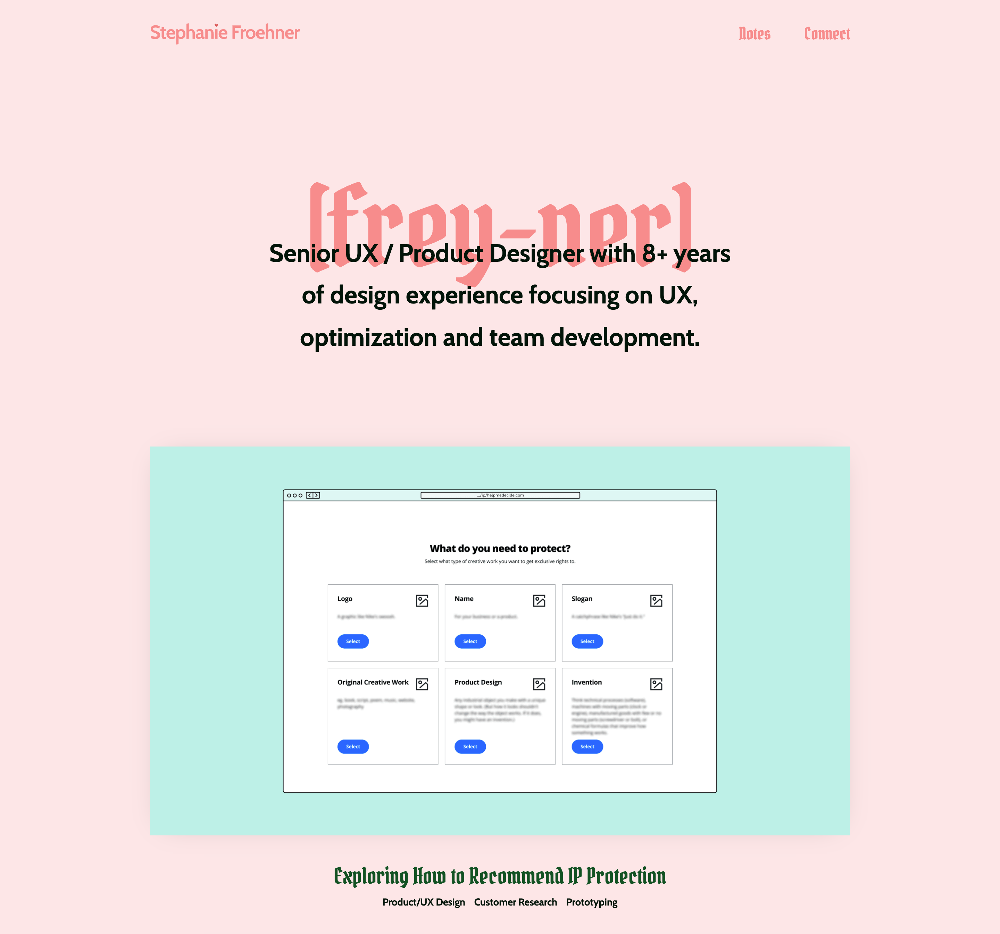

# Finally updating my portfolio -- for real this time!

I haven't had a major overhaul on my public-facing portfolio in YEARS, 4ish? It wasn't really a huge problem and I was able to get 2 great jobs with it. 

I also built a new redesign about 2 years ago and never launched it. (A shame, because it was cute!) Then, my chosen CMS, Forestry.io, was discontinued/depricated in April of this year... Not being able to update it anymore was kind of stressing me out (what if I find a typo I haven't noticed in 5 years?!)

In the past I've used Stackbit to generate a site and then modified it to my liking. My unreleased portfolio relied on Forestry, Gridsome, and Netlify. I didn't love Gridsome, so I was interested in trying something new.

I googled a bunch of ways to get a new template on Netlify, I opened every link for a template... I was looking for something FAST, lightweight and easy enough that I didn't have to spend a ton of time getting it up or learning, but different enough that it was fun to work on and learn. Then I just deployed one. 

It was SO easy to deploy directly from [Astro's theme page](https://astro.build/themes). I remember sitting on my couch late one night and tipping my head back and laughing because I was feeling totally lost until the moment it was literally NO BIG DEAL to have a brand new site to start editing. 

So far Tailwind CSS and Markup have been really easy to get used to and I don't really miss having a CMS layer to my website. Easy!!

________________________________

# Quick recommendation:
**Nimona** on Netflix! I laughed. I cried. It was very cute (and metal).
