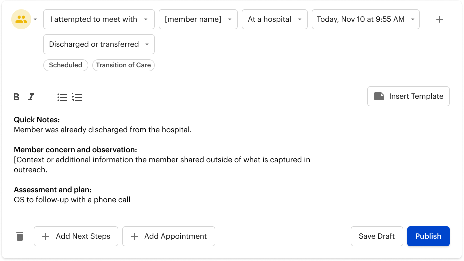

# Background

Outreach Specialists document each interaction with a member in "Outreach Notes", which had a dropdown for "outcome" of the outreach session. 

When I joined, Outreach Specialists had to write two notes - one for the timeline and one for the outreach-specific documentation (often the same thing, but the data was stored seperately. Once our team learned this, we had it automatically duplicate while we fixed the rest of the workflow. 

- I noticed they used "other" for a variety of outcomes (like mail, continuous ringing, and other hyper-specific outcomes)
- The outcomes were not very specific
- The outcome field was dynamic, but unintuitive
- Outreach outcomes were part of an old system, totally unique to the old Outreach / Intake workflow. To migrate to the newer system, we'll need to be more forward-thinking in how we collect data.

## Goals 
- Simplify the note-taking experience and capture data that can drive insights and efficiency.
- Build a tool that connects to the larger system and can drive automated workflows.

# Exploration

## Data and Stakeholder feedback
- Outreach Leads wanted to drive efficiency and better insights into why members were not consenting.
- Outreach Specialists found the tool to be annoying to use, it didn't match how they worked

## Mapping

- Complicated!
- Lots of overlap on the outcomes
- A bigger problem emberges: the logic for the outcomes is based on the participant, not the contact type. This is often incorrect and is limiting. Also, most participants have the same or similar outcomes, making the data not very useful.
- Example of a possible outcome: Who did you speak to? No one. And what was the outcome? Unable to access home (?????)

## Documenting Logic in Google Sheets

- A lot of the options, while dynamic, were also irrelevant and complicating the task

- It just doesn't fit in with how we usually fram actions and sentences. An Outreach Specialist didn't call "No one" they called the member.

## Entity Relationship Modeling

- Since the logic was broken and the technology was old, we decided rethink it entirely
- ER modeling breaks systems/journeys down what is actually happening during outreach and the possible outcomes. Outreach Outcomes are *actually* more simple than it first appeared.
- There are only 6 ways to conduct outreach: Phone call, meeting or visit, text, email, mail, or researching the member
- Phone
  - 
- Visit
  - 
- Mail
  - 
- Text
  - 
  - Text, email, and mail are especially simple! You sent it and it went through or there was an error.

# Proposed Solution

- Base logic on the **type** and the **outcome** of the outreach, not on the participant
- Fewer initial choices with secondary options as needed
- Remove "other" and enforce structured data!

## Breakdown: Phone call
Adding the complexity of a secondary field to increase data accuracy and reduce UI clutter. 

# Summary
- Outcome logic is based on attempt type
- We replace "Other" with more accurate outcomes
- Add more in-person outcomes for richer data collection
- More secondary outcome fields to simplify the UI and support better data collection
- Prioritize building tools to automatically document campaigns so an Outreach Specialist doesn't have to docuement member outreach one by one.
- Trigger new workflows with more accurate outcomes

# Vision

These outcomes can drive workflows within the system so we no longer have to rely on Outreach Specialists knowing what to do for each member that has been prioritized for outreach. 

#### References + Thanks:
- Huge shoutout to Mike L. for introducing me to entity relationship modeling. https://en.wikipedia.org/wiki/Entity–relationship_model
- Kim D. was also an incredible resource for understanding team goals and work structure.
