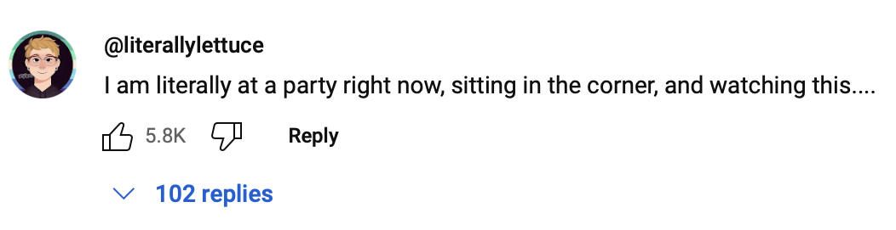
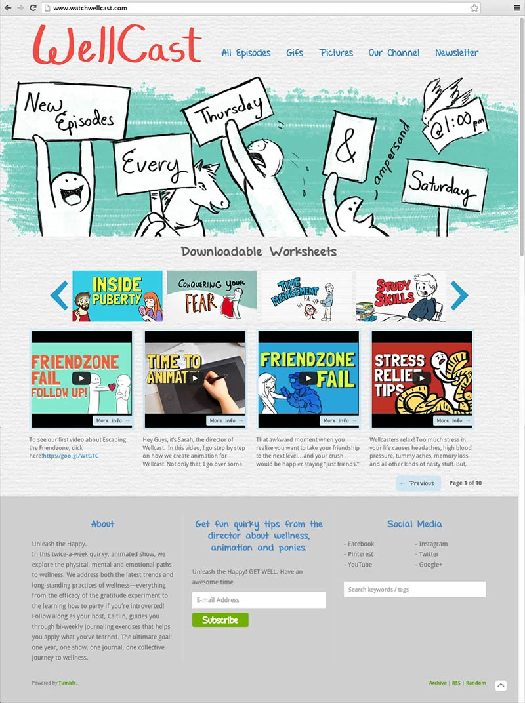

# Background
The show began as journaling exercises based on wellness trends, but quickly grew into a show for anxious youngsters unsure about growing up.

<iframe width="560" height="315" src="https://www.youtube.com/embed/1rcqwRgVvvw" title="YouTube video player" frameborder="0" allow="accelerometer; autoplay; clipboard-write; encrypted-media; gyroscope; picture-in-picture; web-share" allowfullscreen></iframe>

WellCast thrived on our connection with the audience; YouTube users are very vocal about what they like (or don't like), so we tailored our content to our beloved ‘WellCasters’ requests.

<iframe width="560" height="315" src="https://www.youtube.com/embed/aZY0A6E_t_8" title="YouTube video player" frameborder="0" allow="accelerometer; autoplay; clipboard-write; encrypted-media; gyroscope; picture-in-picture; web-share" allowfullscreen></iframe>

I was involved in content strategy, which needed to balance the business goals of virality and low production costs, with the viewer’s needs (while utilizing YouTube’s various features, like annotations).

<iframe width="560" height="315" src="https://www.youtube.com/embed/miTPjiHmDos" title="YouTube video player" frameborder="0" allow="accelerometer; autoplay; clipboard-write; encrypted-media; gyroscope; picture-in-picture; web-share" allowfullscreen></iframe>

I interacted with our audience through YouTube comments, emails and social media. I worked with the show’s writer and director to plan episodes, balance the channel’s point of view, and further push audience development.

<iframe width="560" height="315" src="https://www.youtube.com/embed/HChusFnyVzE" title="YouTube video player" frameborder="0" allow="accelerometer; autoplay; clipboard-write; encrypted-media; gyroscope; picture-in-picture; web-share" allowfullscreen></iframe>

My visual design roles in this project include designing thumbnails for each YouTube video (taking into account the various device and viewport sizes of YouTube), creating and maintaining the website, so viewers could download the .pdf content, and creating assets for the social media accounts.

- **Date:** 2013
- **Company:** Mahalo

